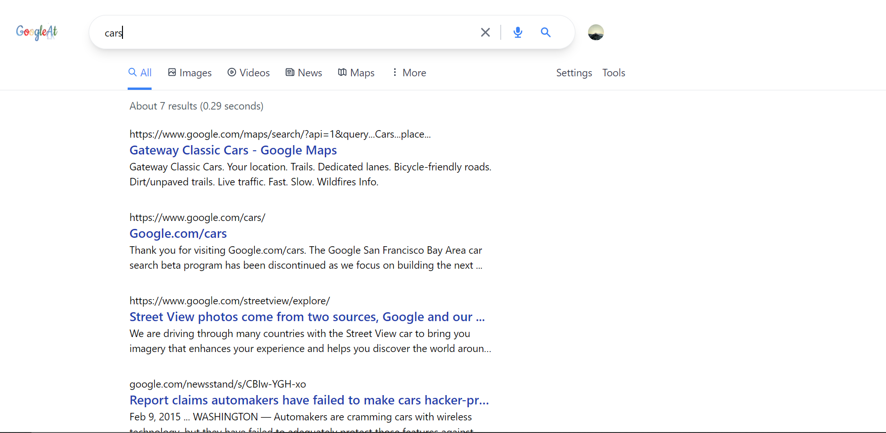
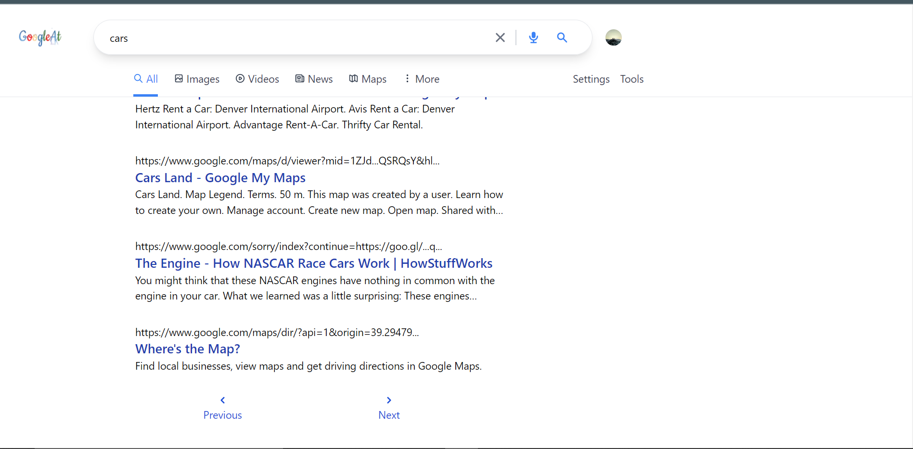

# GoogleAt
## Description
[GoogleAt](googleat.vercel.app) is a _google clone_ built using Javascript framework **Next.js** and styled using **Tailwind**. It uses _googleapis_ to load the specific search results.

## Tech Stack
- [x] Next.js
- [x] Tailwind
- [x] Google Search API
## Features
* Search
* Pagination
* Responsive

## Home Screen

## Search page

## Pagination

